# Remote desktop connection and bring up

Check the videos and materials in: [`R550PLUS ROS大型科研机器人资料（ROS大车）/1.WHEELTEC ROS机器人通用资料/6.ROS2系列教程/2.ROS2机器人应用视频教程：上手使用、雷达与2D导航/1.ROS2小车上手操作`](https://unbcloud-my.sharepoint.com/:f:/r/personal/j7e8q_unb_ca/Documents/IMRL_2025_manuals/WheelTECH/R550PLUS%20ROS%E5%A4%A7%E5%9E%8B%E7%A7%91%E7%A0%94%E6%9C%BA%E5%99%A8%E4%BA%BA%E8%B5%84%E6%96%99%EF%BC%88ROS%E5%A4%A7%E8%BD%A6%EF%BC%89/1.WHEELTEC%20ROS%E6%9C%BA%E5%99%A8%E4%BA%BA%E9%80%9A%E7%94%A8%E8%B5%84%E6%96%99/6.ROS2%E7%B3%BB%E5%88%97%E6%95%99%E7%A8%8B/2.ROS2%E6%9C%BA%E5%99%A8%E4%BA%BA%E5%BA%94%E7%94%A8%E8%A7%86%E9%A2%91%E6%95%99%E7%A8%8B%EF%BC%9A%E4%B8%8A%E6%89%8B%E4%BD%BF%E7%94%A8%E3%80%81%E9%9B%B7%E8%BE%BE%E4%B8%8E2D%E5%AF%BC%E8%88%AA/1.ROS2%E5%B0%8F%E8%BD%A6%E4%B8%8A%E6%89%8B%E6%93%8D%E4%BD%9C?csf=1&web=1&e=YLcJNM)

In this part, the basic connection methods between PC and robots will be introduced, along with corresponding trouble shooting method.

## Access the robot by remote desktop connection

Both robot and PC were in the same WI-FI 'wheeltec_multi' and their ipv4 gateway is `192.168.0.1` under the `255.255.255.0` mask. In this intro, the ubuntu PC ip address is `192.168.0.102`, the Win11 PC IP is `192.168.0.119` and the robot is in range `192.168.0.101` - `192.168.0.118`. 

The first step is to connect the Wi-Fi 'wheeltec_multi', enter the password 'dongguan'.

Before connecting to VNC, we need to ping the ip address to make sure the connection with the car is ready. So, type `ping <ip>` in terminal:

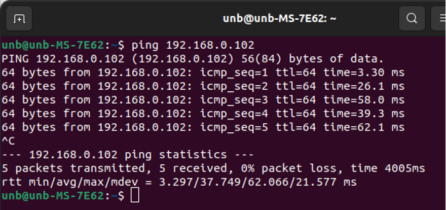{width=90%}

Usually when we start the robot, it takes about 2 mins to connect to the WI-FI. If the ping does not pass for a long time, try to restart the router.

### Remote desktop for Ubuntu {-}

Then open the Remmina app, select VNC, and enter the password.

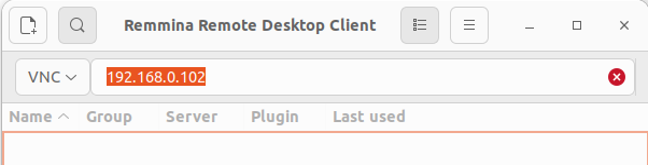{width=80%}

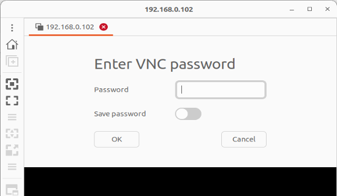{width=70%}

<span style="color:red;">Troubleshooting:</span>

If VNC cannot connect to car, you could restart the router and wait for 5 mins, then reconnect again. If the connection issue is still there, could restart PC. It is recommended to 'shut down' and then start manually, instead of 'restart'.

### Remote desktop for Win11 {-}

Open the MobaXtern app, and then click new session (or previous session if you connect before). Select the VNC on the top side menu. Finally, enter the vehicle’s ip address and password.

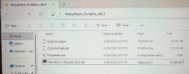{width=80%}

{width=60%}

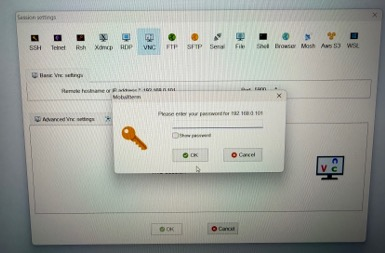{width=80%}

## Check the Sensors

The turn_on_wheeltec_robot function package is used to establish a communication link between the ROS master controller and the STM32 control board. It is responsible for data exchange and the transmission of control commands, enabling the sending of control instructions and the return of sensor data. So, the first step is to wake up the robot hardware:
```bash
ros2 launch turn_on_wheeltec_robot turn_on_wheeltec_robot.launch.py
```

Camera: 
```bash
ros2 launch turn_on_wheeltec_robot wheeltec_camera.launch.py
```

Lidar:
```bash
ros2 launch turn_on_wheeltec_robot wheeltec_lidar.launch.py
```

## Headless remote desktop setup and restoration

In order to control the follower vehicle when it is running, its control method was set up to remote desktop.

The linux system on the follower vehicle (2 small vehicle) were set up to share screen (or called remote desktop) via wheeltec_multi local area network. It is accomplished by file:
```
/etc/X11/xorg.conf.d/10-headless.conf
```

If you want to get access to follower Linux system desktop directly, please get access to it through remote desktop, rename the file:
```
10-headless.conf ---> 10-headless.bak
```

Then disconnect the follower vehicle and restart the follower vehicle. After that, you can connect the monitor, keyboard and mouse to the Jesson Orin board to get access to the local desktop directly. And vice versa, you can also rename back to access the remote desktop.

Caution: make sure the Jetson Orin could connect the Wi-Fi successfully before switching to headless remote desktop mode.

## NFS mount and programming

The Network File System (NFS) is a Linux-supported distributed file system protocol that allows remote directories to be mounted and accessed as part of the local file system. In an NFS-based client–server architecture, the server exports a shared directory, while the client mounts the directory through the network using the Linux mount mechanism. NFS is widely used for centralized file sharing and data exchange between multiple Linux devices due to its simplicity, transparency, and efficient network-based storage access.

Open the terminal an enter the command: 
```bash
sudo mount –t nfs <vehicle ip>:<the directory you wish to mount> /mnt
```

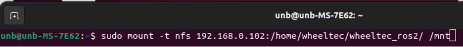{width=100%}

Then, the mounted folder will be accessed through /mnt folder and vscode could open this folder for programming (could also open `Files --> Other locations --> computer --> mnt`).

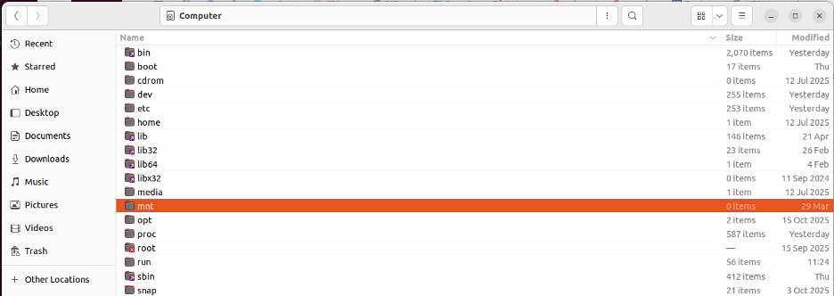{width=100%}

<span style="color:red; font-size:150%">! Do not forget to unmount when you finish programming:</span>

```bash
sudo umount –t nfs <vehicle ip>:<the directory you wish to mount> /mnt
```

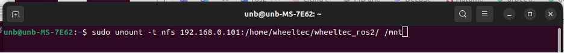{width=100%}


# Operate using Keyboard and Game Controller

This part introduce teh basic control methods to control the robot motions include go forward, backward, trun left and right. The controll was accomplished by Keyboard and Game Controller . The Keyboard controller is to control the robot from Jesson Orin board and transfer the control signal to STM32 board; the Game Controller is to control from the STM32 board directly.

It is important that two control methods cannot run simultaneously. The robot nly have ROS On/Off mode. If you want to control the vehicle by the Game Controller, make sure to close the terminal which control the robot.

## Keyboard

Check the videos and materials in: [`R550PLUS ROS大型科研机器人资料（ROS大车）/1.WHEELTEC ROS机器人通用资料/6.ROS2系列教程/2.ROS2机器人应用视频教程：上手使用、雷达与2D导航/2.ROS2键盘控制`](https://unbcloud-my.sharepoint.com/:f:/r/personal/j7e8q_unb_ca/Documents/IMRL_2025_manuals/WheelTECH/R550PLUS%20ROS%E5%A4%A7%E5%9E%8B%E7%A7%91%E7%A0%94%E6%9C%BA%E5%99%A8%E4%BA%BA%E8%B5%84%E6%96%99%EF%BC%88ROS%E5%A4%A7%E8%BD%A6%EF%BC%89/1.WHEELTEC%20ROS%E6%9C%BA%E5%99%A8%E4%BA%BA%E9%80%9A%E7%94%A8%E8%B5%84%E6%96%99/6.ROS2%E7%B3%BB%E5%88%97%E6%95%99%E7%A8%8B/2.ROS2%E6%9C%BA%E5%99%A8%E4%BA%BA%E5%BA%94%E7%94%A8%E8%A7%86%E9%A2%91%E6%95%99%E7%A8%8B%EF%BC%9A%E4%B8%8A%E6%89%8B%E4%BD%BF%E7%94%A8%E3%80%81%E9%9B%B7%E8%BE%BE%E4%B8%8E2D%E5%AF%BC%E8%88%AA/2.ROS2%E9%94%AE%E7%9B%98%E6%8E%A7%E5%88%B6?csf=1&web=1&e=P0ZaKB)

Step1: Open 1 terminal and type the command below to enable the robot hardware
```bash
ros2  launch turn_on_wheeltec_robot turn_on_wheeltec_robot.launch.py
```

Step2: Open another terminal and type the command below to enable keyboard control
```bash
ros2 run wheeltec_robot_keyboard wheeltec_keyboard
```

Then, the terminal (which run wheeltec_keyboard) will prompt the control method.

<table style="width:60%; border:1px solid black; border-collapse:collapse;">
    <tr>
        <td style="width:33.3%; border:1px solid black; border-collapse:collapse;text-align:center; vertical-align:middle">
        </td>
        <td style="width:33.3%; border:1px solid black; border-collapse:collapse;text-align:center; vertical-align:middle">I<br>Forward
        </td>
        <td style="width:33.3%; border:1px solid black; border-collapse:collapse;text-align:center; vertical-align:middle">
        </td>
    </tr>
    <tr>
        <td style="width:33.3%; border:1px solid black; border-collapse:collapse;text-align:center; vertical-align:middle">J<br>Turn left
        </td>
        <td style="width:33.3%; border:1px solid black; border-collapse:collapse;text-align:center; vertical-align:middle">K<br>Stop
        </td>
        <td style="width:33.3%; border:1px solid black; border-collapse:collapse;text-align:center; vertical-align:middle">L<br>Turn right
        </td>
    </tr>
    <tr>
        <td style="width:33.3%; border:1px solid black; border-collapse:collapse;text-align:center; vertical-align:middle">
        </td>
        <td style="width:33.3%; border:1px solid black; border-collapse:collapse;text-align:center; vertical-align:middle">,<br>Backward
        </td>
        <td style="width:33.3%; border:1px solid black; border-collapse:collapse;text-align:center; vertical-align:middle">
        </td>
    </tr>
</table>

q/z : increase/decrease max speeds by 10%

w/x : increase/decrease only linear speed by 10%

e/c : increase/decrease only angular speed by 10%

When finished, press CTRL+C in the terminal to quit the program.

## Game Controller

Check the videos and materials in: [`R550PLUS ROS大型科研机器人资料（ROS大车）/1.WHEELTEC ROS机器人通用资料/6.ROS2系列教程/4.ROS2机器人进阶应用视频教程/1.ROS2USB手柄控制`](https://unbcloud-my.sharepoint.com/:f:/r/personal/j7e8q_unb_ca/Documents/IMRL_2025_manuals/WheelTECH/R550PLUS%20ROS%E5%A4%A7%E5%9E%8B%E7%A7%91%E7%A0%94%E6%9C%BA%E5%99%A8%E4%BA%BA%E8%B5%84%E6%96%99%EF%BC%88ROS%E5%A4%A7%E8%BD%A6%EF%BC%89/1.WHEELTEC%20ROS%E6%9C%BA%E5%99%A8%E4%BA%BA%E9%80%9A%E7%94%A8%E8%B5%84%E6%96%99/6.ROS2%E7%B3%BB%E5%88%97%E6%95%99%E7%A8%8B/4.ROS2%E6%9C%BA%E5%99%A8%E4%BA%BA%E8%BF%9B%E9%98%B6%E5%BA%94%E7%94%A8%E8%A7%86%E9%A2%91%E6%95%99%E7%A8%8B/1.ROS2USB%E6%89%8B%E6%9F%84%E6%8E%A7%E5%88%B6?csf=1&web=1&e=rcqKaf)

When we turn on the robot, the stm32 monitor will show the default control method, which is ros2. When we push the 'power' button and then push 'start' button, the monitor will show 'ps2 on' at the lower right. 

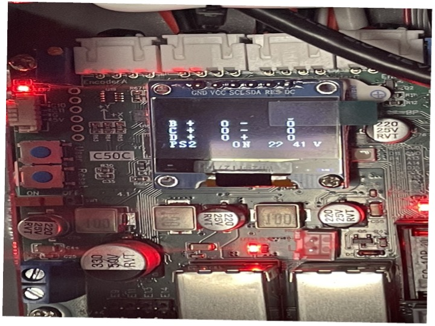{width=40%}

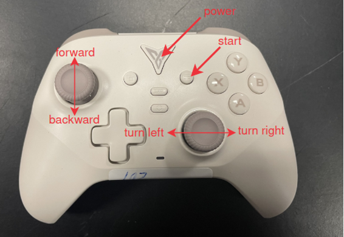{width=60%}

When finished, hold the 'power' button for 5 seconds to turn off the controller.


# Camera systems and OpenCV

Check the videos and materials in: [`R550PLUS ROS大型科研机器人资料（ROS大车）/1.WHEELTEC ROS机器人通用资料/6.ROS2系列教程/3.ROS2机器人应用视频教程：相机与图像处理/1.在ROS2 环境下打开摄像头查看实时图像流（无视频）`](https://unbcloud-my.sharepoint.com/:f:/r/personal/j7e8q_unb_ca/Documents/IMRL_2025_manuals/WheelTECH/R550PLUS%20ROS%E5%A4%A7%E5%9E%8B%E7%A7%91%E7%A0%94%E6%9C%BA%E5%99%A8%E4%BA%BA%E8%B5%84%E6%96%99%EF%BC%88ROS%E5%A4%A7%E8%BD%A6%EF%BC%89/1.WHEELTEC%20ROS%E6%9C%BA%E5%99%A8%E4%BA%BA%E9%80%9A%E7%94%A8%E8%B5%84%E6%96%99/6.ROS2%E7%B3%BB%E5%88%97%E6%95%99%E7%A8%8B/3.ROS2%E6%9C%BA%E5%99%A8%E4%BA%BA%E5%BA%94%E7%94%A8%E8%A7%86%E9%A2%91%E6%95%99%E7%A8%8B%EF%BC%9A%E7%9B%B8%E6%9C%BA%E4%B8%8E%E5%9B%BE%E5%83%8F%E5%A4%84%E7%90%86/1.%E5%9C%A8ROS2%20%E7%8E%AF%E5%A2%83%E4%B8%8B%E6%89%93%E5%BC%80%E6%91%84%E5%83%8F%E5%A4%B4%E6%9F%A5%E7%9C%8B%E5%AE%9E%E6%97%B6%E5%9B%BE%E5%83%8F%E6%B5%81%EF%BC%88%E6%97%A0%E8%A7%86%E9%A2%91%EF%BC%89?csf=1&web=1&e=zfAjHY) and [`/ R550PLUS ROS大型科研机器人资料（ROS大车）/1.WHEELTEC ROS机器人通用资料/6.ROS2系列教程/3.ROS2机器人应用视频教程：相机与图像处理/2.OpenCV入门及其在ROS2环境下的应用`](https://unbcloud-my.sharepoint.com/:f:/r/personal/j7e8q_unb_ca/Documents/IMRL_2025_manuals/WheelTECH/R550PLUS%20ROS%E5%A4%A7%E5%9E%8B%E7%A7%91%E7%A0%94%E6%9C%BA%E5%99%A8%E4%BA%BA%E8%B5%84%E6%96%99%EF%BC%88ROS%E5%A4%A7%E8%BD%A6%EF%BC%89/1.WHEELTEC%20ROS%E6%9C%BA%E5%99%A8%E4%BA%BA%E9%80%9A%E7%94%A8%E8%B5%84%E6%96%99/6.ROS2%E7%B3%BB%E5%88%97%E6%95%99%E7%A8%8B/3.ROS2%E6%9C%BA%E5%99%A8%E4%BA%BA%E5%BA%94%E7%94%A8%E8%A7%86%E9%A2%91%E6%95%99%E7%A8%8B%EF%BC%9A%E7%9B%B8%E6%9C%BA%E4%B8%8E%E5%9B%BE%E5%83%8F%E5%A4%84%E7%90%86/2.OpenCV%E5%85%A5%E9%97%A8%E5%8F%8A%E5%85%B6%E5%9C%A8ROS2%E7%8E%AF%E5%A2%83%E4%B8%8B%E7%9A%84%E5%BA%94%E7%94%A8?csf=1&web=1&e=5E8a3R)

Include this: [`R550PLUS ROS大型科研机器人资料（ROS大车）/1.WHEELTEC ROS机器人通用资料/6.ROS2系列教程/4.ROS2机器人进阶应用视频教程/5.相机内参标定`](https://unbcloud-my.sharepoint.com/:f:/r/personal/j7e8q_unb_ca/Documents/IMRL_2025_manuals/WheelTECH/R550PLUS%20ROS%E5%A4%A7%E5%9E%8B%E7%A7%91%E7%A0%94%E6%9C%BA%E5%99%A8%E4%BA%BA%E8%B5%84%E6%96%99%EF%BC%88ROS%E5%A4%A7%E8%BD%A6%EF%BC%89/1.WHEELTEC%20ROS%E6%9C%BA%E5%99%A8%E4%BA%BA%E9%80%9A%E7%94%A8%E8%B5%84%E6%96%99/6.ROS2%E7%B3%BB%E5%88%97%E6%95%99%E7%A8%8B/4.ROS2%E6%9C%BA%E5%99%A8%E4%BA%BA%E8%BF%9B%E9%98%B6%E5%BA%94%E7%94%A8%E8%A7%86%E9%A2%91%E6%95%99%E7%A8%8B/5.%E7%9B%B8%E6%9C%BA%E5%86%85%E5%8F%82%E6%A0%87%E5%AE%9A?csf=1&web=1&e=N45ndz)

Include this: [`R550PLUS ROS大型科研机器人资料（ROS大车）/1.WHEELTEC ROS机器人通用资料/6.ROS2系列教程/3.ROS2机器人应用视频教程：相机与图像处理/实时查看机器人摄像头画面（图传功能）简单流程.txt`](https://unbcloud-my.sharepoint.com/:t:/r/personal/j7e8q_unb_ca/Documents/IMRL_2025_manuals/WheelTECH/R550PLUS%20ROS%E5%A4%A7%E5%9E%8B%E7%A7%91%E7%A0%94%E6%9C%BA%E5%99%A8%E4%BA%BA%E8%B5%84%E6%96%99%EF%BC%88ROS%E5%A4%A7%E8%BD%A6%EF%BC%89/1.WHEELTEC%20ROS%E6%9C%BA%E5%99%A8%E4%BA%BA%E9%80%9A%E7%94%A8%E8%B5%84%E6%96%99/6.ROS2%E7%B3%BB%E5%88%97%E6%95%99%E7%A8%8B/3.ROS2%E6%9C%BA%E5%99%A8%E4%BA%BA%E5%BA%94%E7%94%A8%E8%A7%86%E9%A2%91%E6%95%99%E7%A8%8B%EF%BC%9A%E7%9B%B8%E6%9C%BA%E4%B8%8E%E5%9B%BE%E5%83%8F%E5%A4%84%E7%90%86/%E5%AE%9E%E6%97%B6%E6%9F%A5%E7%9C%8B%E6%9C%BA%E5%99%A8%E4%BA%BA%E6%91%84%E5%83%8F%E5%A4%B4%E7%94%BB%E9%9D%A2%EF%BC%88%E5%9B%BE%E4%BC%A0%E5%8A%9F%E8%83%BD%EF%BC%89%E7%AE%80%E5%8D%95%E6%B5%81%E7%A8%8B.txt?csf=1&web=1&e=a06gyL)

Include this: [`R550PLUS ROS大型科研机器人资料（ROS大车）/1.WHEELTEC ROS机器人通用资料/6.ROS2系列教程/3.ROS2机器人应用视频教程：相机与图像处理/5.ROS2WEB浏览器监控`](https://unbcloud-my.sharepoint.com/:f:/r/personal/j7e8q_unb_ca/Documents/IMRL_2025_manuals/WheelTECH/R550PLUS%20ROS%E5%A4%A7%E5%9E%8B%E7%A7%91%E7%A0%94%E6%9C%BA%E5%99%A8%E4%BA%BA%E8%B5%84%E6%96%99%EF%BC%88ROS%E5%A4%A7%E8%BD%A6%EF%BC%89/1.WHEELTEC%20ROS%E6%9C%BA%E5%99%A8%E4%BA%BA%E9%80%9A%E7%94%A8%E8%B5%84%E6%96%99/6.ROS2%E7%B3%BB%E5%88%97%E6%95%99%E7%A8%8B/3.ROS2%E6%9C%BA%E5%99%A8%E4%BA%BA%E5%BA%94%E7%94%A8%E8%A7%86%E9%A2%91%E6%95%99%E7%A8%8B%EF%BC%9A%E7%9B%B8%E6%9C%BA%E4%B8%8E%E5%9B%BE%E5%83%8F%E5%A4%84%E7%90%86/5.ROS2WEB%E6%B5%8F%E8%A7%88%E5%99%A8%E7%9B%91%E6%8E%A7?csf=1&web=1&e=k4cHiE)

## Camera system {#camera-system}

###	Before using the camera system

a)	Check the Wi-Fi connection and make sure the PC can ping the robot IP address successfully.

b)	Make sure the rqt toolbox is installed by typing `rqt` in the terminal. If installed, one new window will open, and the camera image will be shown.

### Operation steps

a)	Open the terminal, ping the IP address (i.e., `192.168.0.101`) and make sure they connected successfully. 

b)	Then, connect the car through ssh or VNC. 

c)	Open terminal and type: `ros2 launch turn_on_wheeltec_robot wheeltec_camera.launch.py`, then the camera is turned on.

d)	Open another terminal, type: `ros2 run rqt_image_view rqt_image_view`. Then the `rqt` UI will show and you can watch different type of image like depth image.

e)	Click the red crossing at the upper right edge of UI. You can also terminate by pressing CTRL+C in terminal.

::: {layout-ncol=2}
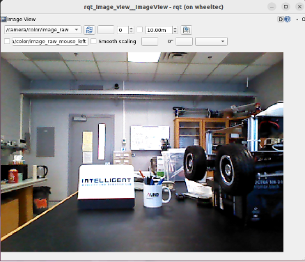{width=47%}

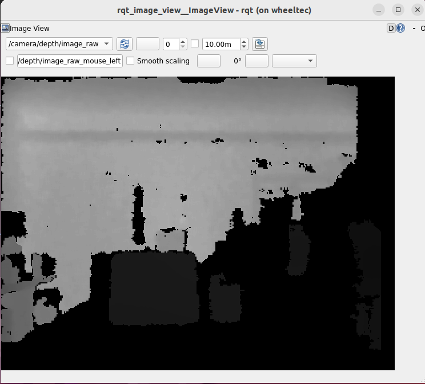{width=45%}
:::

## OpenCV Basics {#opencv-basics}

In this part, the code is supplied and 

### Install OpenCV and python OpenCV package

The first step is to check opencv installation
```bash
pip show opencv-python
pip show opencv-contrib-python
```

If not installed, install them by the command below:
```bash
pip install opencv-python
pip install opencv-contrib-python
```

The second step is to check the `opencv` for `ros2` package. There are 2 packages that is required: `cv_bridge` and `vision_opencv` for `ros2`

Also, check the installation first:
```bash
dpkg -l | grep ros-humble-vision-opencv
```

If not installed, run the command below:
```bash
sudo apt update
sudo apt install ros-humble-vision-opencv
```

### Basic operations of openCV

The code is in OneDrive folder `Program_OpenCV_And_ROS2_ENG`

#### Read, process, and save image
In this part, an image will be read and will show its affine transformation and drawing. The program is `1_ImageProcess.py`.

a)  Import packages:
```{python}
import cv2
import numpy as np
```

b)  Read the image:
The image file is `1.ImageProcess.jpg`

{width=60%}

This code read the image and down scale the image to 1/2 of its original size.

```python
# read the image
img_origin = cv2.imread('1. ImageProcess.jpg') # when image read sucessfully, it will return a 3D numpy array
img_height, img_width, img_channels = img_origin.shape # acquire the length, width and number of channels

cv2.imshow("windows_origin", img_origin) # show the image

# shrink the size of an image by 1/2 of height and width
img = cv2.resize(img_origin, (int(img_width/2), int(img_height/2)), interpolation=cv2.INTER_AREA)
img_height, img_width, img_channels = img.shape
cv2.imshow("windows", img) # show the shrinked image
```

The result is shown below:

{width=30%}

c)  Affine transform
This code upscale image 1.6 times and move $–150$ pixel along $x$-axis, $-120$ pixels along $y$-axis:
```python
# create the array for affine trasnformation
Mat1 = np.array([
    [1.6, 0, -150], # x-axis scale t o 1.6 times and move -150 pixel along x-asix
    [0, 1.6, -120] # y-axis scale to 1.6 times and move -120 pixel along x-asix
], dtype=np.float32)
img1 = cv2.warpAffine(img, Mat1, (img_width, img_height)) # apply the affine transform
cv2.imshow("windows1", img1) # show the modified image
cv2.imwrite('1.ImageProcess1.jpg', img1) # save the modified image
```

The result is shown below:

{width=60%}

This code shears the image 15 degrees counterclockwise.
```python
theta = 15 * np.pi / 180 # rotate 15 degree, transform to rad

# shear 15 degree counter-clockwise along upper edge of image
Mat2 = np.array([
    [1, np.tan(theta), 0],
    [0, 1, 0]
], dtype=np.float32)
img2 = cv2.warpAffine(img, Mat2, (img_width, img_height)) # apply the affine transform
cv2.imshow("windows2", img2) # show the image
cv2.imwrite('1.ImageProcess2.jpg', img2) # save the image
```

The result is shown below:

{width=60%}

Rotate the image 15 degrees clockwise along the upper left corner.
```python
# rotate 15 degree clockwise along upper left point of image
Mat3 = np.array([
    [np.cos(theta), -np.sin(theta), 0],
    [np.sin(theta), np.cos(theta), 0]
], dtype=np.float32)
img3 = cv2.warpAffine(img, Mat3, (img_width, img_height)) # apply the affine transform
cv2.imshow("windows3", img3) # show the image
cv2.imwrite('1.ImageProcess3.jpg', img3) # save the image
```

{width=60%}

Then, 1 line, 1 circle, 2 rectangle and 1 text was added to the image:
```python
# draw a straight line cv2.line(inage, line(inage, start point, end point, (blue, green, red), line thickness)
cv2.line(img, (300, 150), (500, 150), (255, 255, 0), 2)

# draw a circle cv2. circle(image, centre point, radius, (blue, green, red), line thickness)
cv2.circle(img, (400, 100), 75, (0, 0, 255), 5)

# draw a rectangle cv2. rectangle(image, upper left point, lower right point, (blue, green, red), line thickness)
cv2.rectangle(img, (620, 100), (700, 220), (255, 0, 0), 3)

# draw a polygon 
triangles = np.array([
    [(200, 100), (145, 203), (255, 203)],
    [(60, 140), (20, 197), (100, 197)]
], dtype=np.int32) # fill the polygon cv2. fillPoly(image, corner, BR)
cv2.fillPoly(img, triangles, (0, 255, 0))

# put text into image cv2.putText (image, text, lower left corner of text, text format, text size, BR, text thickness)
cv2.putText(img, "WHEELTEC", (1, 30), cv2.FONT_HERSHEY_SIMPLEX, 1, (0, 255, 0), 2)

cv2.imshow("windows_draw", img) #show image
```

{width=60%}

#### Pixel Process {#pixel-process}

In this section, an image will be created for the pixel processing. Image channels of HSV and LAB will be introduced. For more detail about the image channels, please refer to section [3.3 OpenCV Image Processing Concepts](#opencv-image-processing-concepts).

#####

In this code, an image with height 400, width 600 was created and assigned value of 120 with unsigned 8-byte integer (`uint8`, taking values in the range 0-255) for each element. Then, column 300-400 was assigned `[255, 0, 0]` as blue.
```{.python startFrom="24" code-line-numbers="true"}
# create a matrix with height*width*chalels, every element is uint8 datatype
# add 120 to each element
img_height = 400
img_width = 600
img = np.zeros((img_height, img_width, 3), dtype=np.uint8) + 120
# assign column 300-400 with value [255,0,0] ([B, G, R])
img[:, 300:400] = [255, 0, 0]
cv2.imshow("img1", img)
```

```{python}
#| echo: false
import matplotlib.pyplot as plt
import cv2
import numpy as np

img = np.zeros((400, 600, 3), dtype=np.uint8) + 120
img[:, 300:400] = [0, 0, 255]
plt.figure(figsize=(3, 2))
plt.imshow(img)
plt.axis("off")
```

Then, the column from 100 to 200 was assigned with `[0, 255, 0]` as green.

```{.python startFrom="35" code-line-numbers="true"}
# assign row 100-200 with value [0,255, 0] ([B, G, R])
img[100:200, :] = [0, 255, 0]
cv2.imshow("img2", img)
```

```{python}
#| echo: false
img[100:200, :] = [0, 255, 0]
plt.figure(figsize=(3, 2))
plt.imshow(img)
plt.axis("off")
```

The area with row 50-300, column 350-500 was cut off by indexing the original image. Another remarkable indexing method is `[row_start:row_end, column_start:column_end]` beside the . So, in line 44, the image row from 50 to 300, column 350 to 500 was selected to be cut off. Also, this could also be used for those 3 examples above.
```{.python startFrom="42" code-line-numbers="true"}
# cut off the area in 50-300 row and 350-500 coulmn
#img[ (height_start:height_end), (width_start:height_end)]
img_CutOff = img[50:300, 350:500]
cv2.imshow("img_CutOff", img_CutOff)
```

```{python}
#| echo: false
img_CutOff = img[50:300, 350:500]
plt.figure(figsize=(0.75, 1.25))
plt.imshow(img_CutOff)
plt.axis("off")
```

The image was converted to HSV channel
```{.python startFrom="47" code-line-numbers="true"}
# the created image is in BRG format by default. this code will transfer to HSV format
img_hsv = cv2.cvtColor(img, cv2.COLOR_BGR2HSV) #HSV format
cv2.imshow("img_hsv", img_hsv)
```

The result is shown below:
```{python}
#| echo: false
img_hsv = cv2.cvtColor(img, cv2.COLOR_RGB2HSV)
img_hsv = cv2.cvtColor(img_hsv, cv2.COLOR_BGR2RGB)
plt.figure(figsize=(3, 2))
plt.imshow(img_hsv)
plt.axis("off")
```

Finally, the image was converted to LAB channel and the image was shown below

```{.python startFrom="51" code-line-numbers="true"}
# this code will transfer to lab format
img_lab = cv2.ctColor(img, cv2. COLOR_BGR2LAB) #LAB format
cv2. imshow("imglab", imglab)
```

```{python}
#| echo: false
img_lab = cv2.cvtColor(img, cv2.COLOR_RGB2LAB)
img_lab = cv2.cvtColor(img_lab, cv2.COLOR_BGR2RGB)
plt.figure(figsize=(3, 2))
plt.imshow(img_lab)
plt.axis("off")
```


### Video Processing{#video-process}

Video is made of a bunch of images called frames, so video processing is taking a specific frame, processing it and putting it back. The example code is shown below:

```{.python code-line-numbers="true"}

#!/usr/bin/env python
# coding=utf-8
#1.declare compliller 2. declare encoding standard
#1:python usually installe in /usr/bin by default,
# so system will search from the path/env first, we can also claim python3
#2:Python.X use utf-8 encoding by default, and it is recommended to declare utf-8 at the beginning.

import cv2          # import cv2 package
import numpy as np  # import array calculation package
# import the vedio and get its frame per seconds, resolution and total number of frames
videoCapture = cv2.VideoCapture("VideoExample.mp4")         # import the vedio
fps=videoCapture.get(cv2.CAP_PROP_FPS)                      # get the FPS
size = (int(videoCapture.get(cv2.CAP_PROP_FRAME_WIDTH)),
        int(videoCapture.get(cv2.CAP_PROP_FRAME_HEIGHT)))   # get the width and height
totalFrames = int (videoCapture.get(7))                     # get the total number of frame

# create a new vedio
videowriter = cv2.VideoWriter(
    "VideoWriterExample.avi", cv2.VideoWriter_fourcc('I', '4', '2', '0'),
    fps, size)

x=10 # water mark x position
y=10 # water mark y position
i=1
step_x=5
step_y=5
success, frame = videoCapture.read() # read the first frame
print ("frame "+str(i)+" of "+str(totalFrames)+" frames")
while success:
    cv2.waitKey(1)
    # add watermark to the image
    cv2.putText(frame, "IMRL", (x, y), cv2.FONT_HERSHEY_SIMPLEX, 1, (0, 0, 255), 2)
    cv2.imshow("frame", frame)
    videowriter.write(frame) # add frame to new video
    
    # change the position of watermark
    if (x>size[0]): step_x=-5
    if (x<0): step_x=5
    if (y>size[1]): step_y=-5
    if (y<0): step_y=5
    x=x+step_x
    y=y+step_y
    success, frame = videoCapture.read() # read the frame one by one
    i=i+1
    print ("frame "+str(i)+" in "+str(totalFrames)+" frames")

print('Quitted!') # show that the program terminated
cv2.destroyAllWindows() # close all windows
```

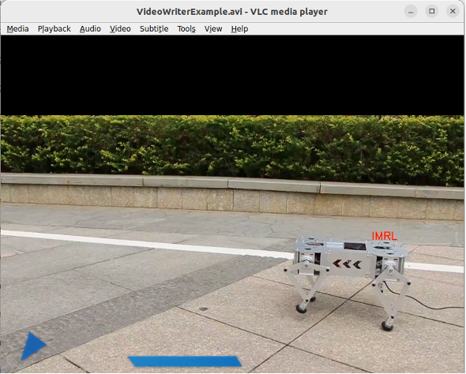{width=60%}


### Read Camera Output and Save as Video {#save-video}

```{.python code-line-numbers="true"}
#!/usr/bin/env python 
# coding=utf-8
#1.declare compliller 2.declare encoding standard
#1:python usually installe in /usr/bin by default, 
#  so system will search from the path/env first, we can also claim python3
#2:Python.X use utf-8 encoding by default，and it is recommended to declare utf-8 at the beginning.

import cv2          # import cv2 package
import numpy as np  # import array calculation package

## import the vedio and get its frame per seconds, resolution and total number of frames
cameraCapture = cv2.VideoCapture(0)
fps=int(cameraCapture.get(cv2.CAP_PROP_FPS))
size = (int(cameraCapture.get(cv2.CAP_PROP_FRAME_WIDTH)),
        int(cameraCapture.get(cv2.CAP_PROP_FRAME_HEIGHT)),)

# create new vedio
cameraWriter = cv2.VideoWriter(
    "CameraWriterExample.avi", cv2.VideoWriter_fourcc('I','4','2','0'),
    fps, size)

x=10 # water mark x position 
y=10 # water mark y position
i=1
step_x=5
step_y=5
succes, frame = cameraCapture.read() # read the first frame of vedio

# show the operation to stop
print ('Showing camera. Press key "Q" to quit.')
print ('Press key "S" to start recording.')
Quit=0           # semaphore for program runnung status
Record=0         # semaphore for record function running status
while succes and not Quit:
    keycode=cv2.waitKey(1)
    if(keycode==ord('q')): # if press 'q', terminate the program
       Quit=1
    if(keycode==ord('s')): # if press 's', start to record
       Record=1
    if(keycode==ord('x')): # if press 'X', stop recording
       Record=0

    if(Record):
        # add watermark to vedio
        cv2.putText(frame, 'IMRL', (x, y), cv2.FONT_HERSHEY_SIMPLEX, 1, (0, 0, 255), 2)
        cameraWriter.write(frame) # add new frame to the vedio

        # change the position of watermark
        if(x>size[0]):step_x=-5
        if(x<0): step_x=5
        if(y>size[1]):step_y=-5
        if(y<0): step_y=5
        x=x+step_x
        y=y+step_y
        print("frame "+str(i))
        i=i+1
        print ('Press key "x" to end recording.')
        print("\n\t")
    cv2.imshow("frame",frame)
    succes, frame = cameraCapture.read() # read teh fame one by one

if succes==0: # show the error messsage if failed reading camera
    print ('Camera disconnect !')
print ('Quitted!') # show the program stopped
cameraCapture.release() # disengage the camera
cv2.destroyAllWindows() # close all windows
```

Like the video process in the previous section, each frame is from the image from the camera

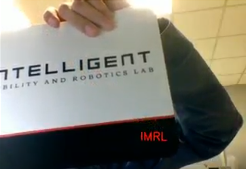{width=50%}


### Image Histogram {#image-histogram}

The image histogram function will be implemented by `cv2.calcHist` function of OpenCV to acquire the image features. This is the first feature extraction method introduced, and it is essential for the following line functions.

In this part, a color image will be used, and the `cv2.calcHist` will be used to count the histogram of pixel distribution of blue, green, and red channels.

The original image is shown below:

{width=50%}

```{.python startFrom="30" code-line-numbers="true"}
import cv2          # import cv2 package
import numpy as np  # import array calculation package
import pygal

# import image
img_origin = cv2.imread('1.ImageProcess.jpg')
img_height, img_width, img_channels = img_origin.shape # acquire height, width and number of channels
#cv2.imshow("windows_origin", img_origin) # show image to the by window 

# shrik the image by 1/2 of its initial size
img = cv2.resize(img_origin, (int(img_width/2),int(img_height/2)), interpolation=cv2.INTER_AREA)  
img_height, img_width, img_channels = img.shape 
cv2.imshow("windows", img) #show the shrinked image

# the mask is to filter out the pixel with value 0, only value higher than or equal to 1 was retained
mask = np.zeros((img_height, img_width, 1), dtype=np.uint8) + 1 # create a grayscale image with valur 1 as a mask

# cv2.calcHist([image], [channel to be calculated], mask, [x-axis range], [the range of value to be involved])
Hist_B_int = cv2.calcHist([img], [0], mask, [100], [0,256]).flatten().tolist()
Hist_G_int = cv2.calcHist([img], [1], mask, [100], [0,256]).flatten().tolist()
Hist_R_int = cv2.calcHist([img], [2], mask, [100], [0,256]).flatten().tolist()
```

In this code, a mask will be applied before the calculation to filter out point with 0 intensity. Because 0 intensity pixels may dominate the calculations. For example, the number of 0 intensity pixels is the highest, and other values are insignificant compared to the number of 0 intensity pixels.

The x-axis range is set to 100, which means that any pixel that has extensity exceeds 100 will be counted as 100. The range of value was set to 0-255 because the intensity value is 8-bit unsigned integer; its value is 0-255. Cause in python, the right boundary is not included, we have to set right boundary to 256 if value 255 wants to be involved.

After calculating the number of pixels in different intensity and different channel, their code with result was shown below:

```{.python startFrom="51" code-line-numbers="true"}
# create blue histogram inage and save as svg file 
hist_pygal_B = pygal.Bar(
    show_minor_x_labels=False,
    x_label_rotation=90,
)
hist_pygal_B.title="pygal_B"
hist_pygal_B.x_labels = [str(i) for i in range(100)]
hist_pygal_B.x_labels_major = [str(i) for i in range(0, 100, 10)]
hist_pygal_B.add("Hist_B", Hist_B_int)
hist_pygal_B.render_to_file('pygal_B.svg')

# create green histogram inage and save as svg file 
hist_pygal_G= pygal.Bar(
    show_minor_x_labels=False,
    x_label_rotation=90,
)
hist_pygal_G.title="pygal_G"
hist_pygal_G.x_labels = [str(i) for i in range(100)]
hist_pygal_G.x_labels_major = [str(i) for i in range(0, 100, 10)]
hist_pygal_G.add("Hist_G", Hist_G_int)
hist_pygal_G.render_to_file('pygal_G.svg')

# create red histogram inage and save as svg file 
hist_pygal_R= pygal.Bar(
    show_minor_x_labels=False,
    x_label_rotation=90,
)
hist_pygal_R.title="pygal_R"
hist_pygal_R.x_labels = [str(i) for i in range(100)]
hist_pygal_R.x_labels_major = [str(i) for i in range(0, 100, 10)]
hist_pygal_R.add("Hist_R", Hist_R_int)
hist_pygal_R.render_to_file('pygal_R.svg')


hist_pygal = pygal.Bar(
    show_minor_x_labels=False,
    x_label_rotation=90,
)
hist_pygal.title = "Histogram of BGR"
hist_pygal.x_title = "Bins"
hist_pygal.y_title = "Number of Pixels"

# Set x-axis labels (bins 0~99)
hist_pygal.x_labels = [str(i) for i in range(100)]
hist_pygal.x_labels_major = [str(i) for i in range(0, 100, 10)]
# Add multiple series (R, G, B)
hist_pygal.add("Blue", Hist_B_int)
hist_pygal.add("Green", Hist_G_int)
hist_pygal.add("Red", Hist_R_int)

# Render to SVG file
hist_pygal.render_to_file('hist_bgr_bar.svg')
```

::: {layout-ncol=2}
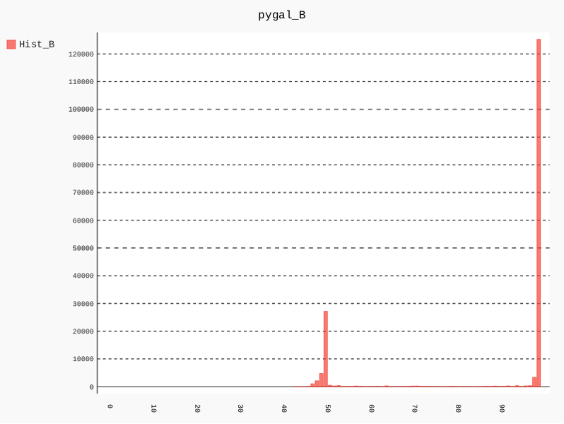{width=45%}

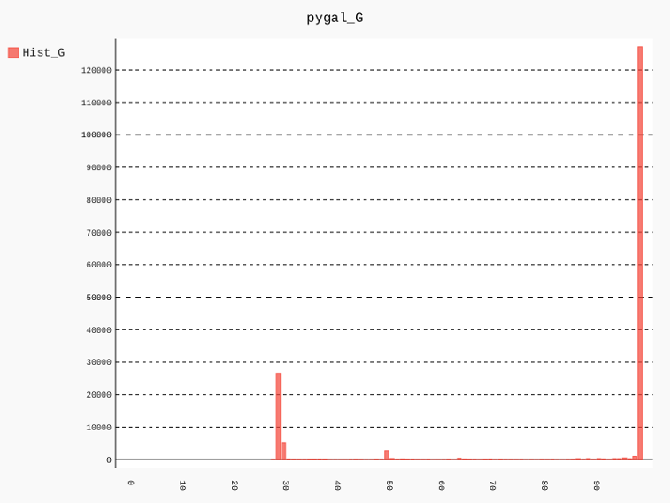{width=45%}

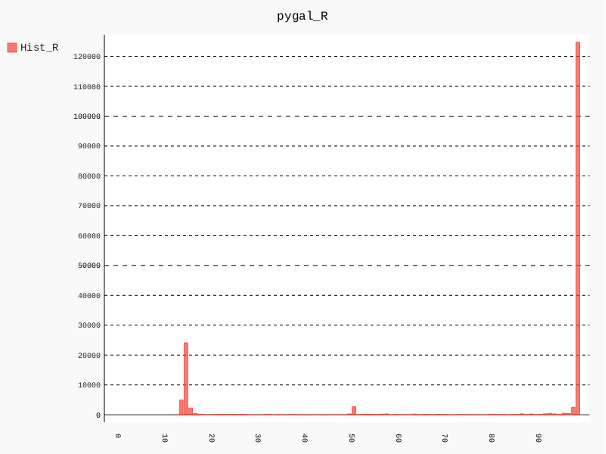{width=45%}

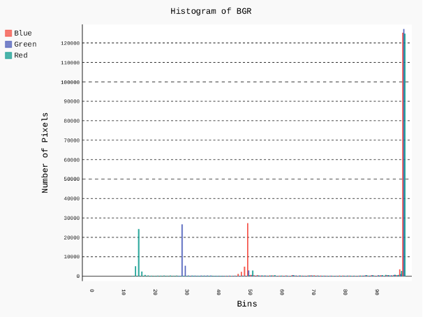{width=45%}
:::


## OpenCV Image Processing Concepts {#opencv-image-processing-concepts}

In this part, image formats and some basic image processing algorithms will be introduced.

### Image channel formats

There are 3 kinds of image format, black/white, grayscale, and color.

The **black/white** image has a binary value, 0 for black and 1 for white.

The **gray scale** image could range from 0-255, where 0 stands for pure black, and 1 stands for pure white.

The color image has 3 channels. Different color formats have different definitions and value ranges for each channel. This manual will introduce 3 kinds of color formats: RGB, Lab and HSV.

- The RGB color format defines channels as red, green, and blue, and each of them range from 0-255. This is the primary format that is directly applied to the screen. `[0, 0, 0]` is black and `[255, 255, 255]` is white.
- The Lab color space has 3 channels L${}^\ast$ lightness, a${}^\ast$ green-red, b${}^\ast$ blue-yellow. The L${}^\ast$ channel contains bright information, where 0 is black and 100 is white (in standard range, will introduce later). The a${}^\ast$ channel contains green and red information, where negative is green and positive is red. The b${}^\ast$ channel contains blue and yellow information, where negative is blue and positive is yellow. For standard range, L${}^\ast$ is $[0, 100]$, a${}^\ast$ is $[-128,127]$, b${}^\ast$ is $[-128, 127]$. But in the OpenCV range, they are in $[0, 255]$. So be careful with the value range. The Lab is human eyes perception based because human eyes have specific types of cells to acquire brightness, red-green and blue-yellow directly.
- The HSV channel defines channels as Hue, Saturation, and Value. The Hue ranges from 0${}^\circ$-360${}^\circ$, where 0° is pure red, 120${}^\circ$ is pure green, and 240${}^\circ$ is pure blue. The Saturation ranges from 0-100%, where 0 stands for gray and 100% stands for full color. Value stands for brightness and ranges from 0-100%, where 0 stands for black and 1 stands for full brightness.  The white is Saturation = 0 and Value = 100%.

```{.python startFrom="13" code-line-numbers="true"}
# prompt the stop method
print ('Press key "Q" to stop.')

frame = cv2.imread('RGB.jpg',1) # import image as color image.

Quit=0 # semaphore to show the program status

while Quit==0:
    keycode=cv2.waitKey(3) # refresh every 3ms and read keyboard input
    if(keycode==ord('q')): # if press q, break the loop and quit this program
        Quit=1
        break

    cv2.imshow('MyWindow', frame) #show  the original image

    # convert RGB to grayscale
    frame_gray = cv2.cvtColor(frame,cv2.COLOR_BGR2GRAY) # the channel is B,G,R order
    cv2.imshow('frame_gray', frame_gray) # show the image
    cv2.imwrite('gray.jpg',frame_gray)   # save the grayscale file

    # convert the grayscale image to binary 
    frame_binary = cv2.inRange(frame_gray,100,150) # set the pixel between 100-150 to white
    cv2.imshow('frame_binary', frame_binary)       # show  the binary image
    cv2.imwrite('frame_binary.jpg',frame_binary)   # save the binary image

        
    # seperathe tthe channel pr BGR color image
    b, g ,r =cv2.split(frame) # the default return order of channel is BGR
    # show the three channels
    cv2.imshow('r', r) # binarilized R
    cv2.imshow('g', g) # binarilized G
    cv2.imshow('b', b) # binarilized B

    # save three channel image seperately
    cv2.imwrite('r.jpg',r)
    cv2.imwrite('g.jpg',g)
    cv2.imwrite('b.jpg',b)

    # convert BGR space to HSV space
    frame_HSV = cv2.cvtColor(frame,cv2.COLOR_BGR2LAB)
    cv2.imshow('frame_HSV', frame_HSV)     # show image
    cv2.imwrite('frame_HSV.jpg',frame_HSV) # save image
    
    frame = cv2.imread('RGB.jpg',1) # import the image again

print ('Quitted!')      # prompt the program has terminated
cv2.destroyAllWindows() # close all windows
```

::: {layout-ncol=3}
{width=100%}

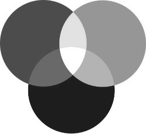{width=100%}

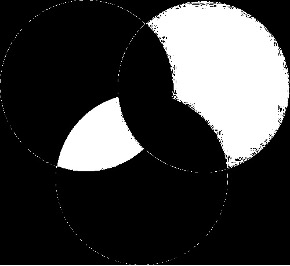{width=100%}

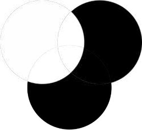{width=100%}

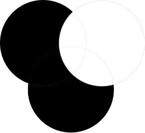{width=100%}

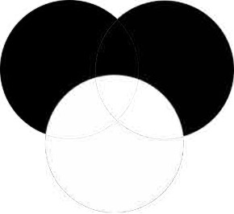{width=100%}

\ 

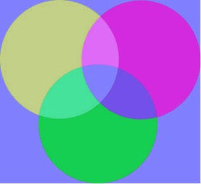{width=100%}
:::

The HSV image changes the color when showing the image because the monitor only accepts the RGB color format; the monitor interprets the HSV channel value as RGB channel value. 


### Image segmentation (binarize)

The binarize method is to set up a threshold value, any pixel value that >= threshold will set to 255 and < threshold will set to 0. Please run `2_DynamicThreshold.py` in ImageBase folder and move the threshold tacking bar to see the changes among different channels.

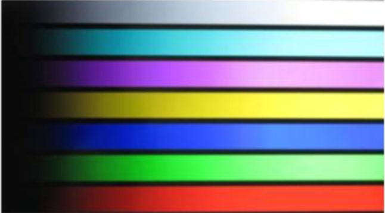{width=60%}

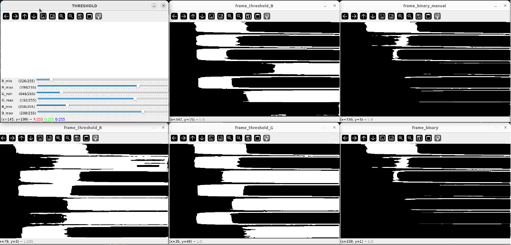{width=100%}


### Erosion and Dilation {#erosion-and-dilation}

Erosion (or erosion) is a kind of morphological operation that is applied to remove small noise, detach connected objects, or make shapes thinner. Dilation is applied to fill small holes or gaps, connect broken parts or make shapes thicker.

The mechanism is to apply a kernel sliding through an image. The erosion is to set the kernel center pixel to 1 only if all pixels under the kernel are 1. The dilation is to set the kernel center pixel to 1 if at least 1 pixel under kernel is 1.

Based on the order of dilation and erosion, 2 combined operations were introduced. Opening is erosion first then dilation, which removes the noise.  Closing is a dilation first then erosion. Please run `3_DynamicDilateErode.py`
The core code is shown below:

The kernel is defined by `cv2.getStructuringElement(shape, (width, height))`. In this code, the shape is rectangular, which is `cv2.MORPH_RECT`. The erosion and dilation are executed by `cv2.erode()` and `cv2.dilate()`.

```{.python startFrom="48" code-line-numbers="true"}
    kernel_width=cv2.getTrackbarPos("kernel_width","THRESHOLD",)
    kernel_height=cv2.getTrackbarPos("kernel_height","THRESHOLD",)
    if(kernel_width<1):kernel_width=1
    if(kernel_height<1):kernel_height=1
```

```{.python startFrom="75" code-line-numbers="true"}
    # read and execute erision and dilation
    kernel = cv2.getStructuringElement(cv2.MORPH_RECT, (kernel_width, kernel_height))
    frame_binary_E = cv2.erode(frame_binary, kernel)
    frame_binary_ED = cv2.dilate(frame_binary_E, kernel)

    frame_binary_D = cv2.dilate(frame_binary, kernel)
    frame_binary_DE = cv2.erode(frame_binary_D, kernel)
    
    cv2.imshow('MyWindow', frame) #show origian lframe
    cv2.imshow('frame_binary', frame_binary)# show binarized image
    cv2.imshow('frame_binary_Dilation', frame_binary_D)
    cv2.imshow('frame_binary_Erosion', frame_binary_E)
    cv2.imshow('frame_binary_Closing', frame_binary_DE)# show erision and drlation result
    cv2.imshow('frame_binary_Opening', frame_binary_ED)# show binarized image
```

Example:

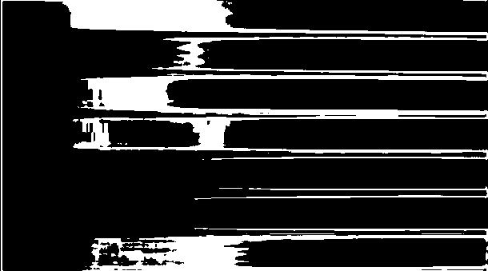{width=50%}

::: {layout-ncol=2}
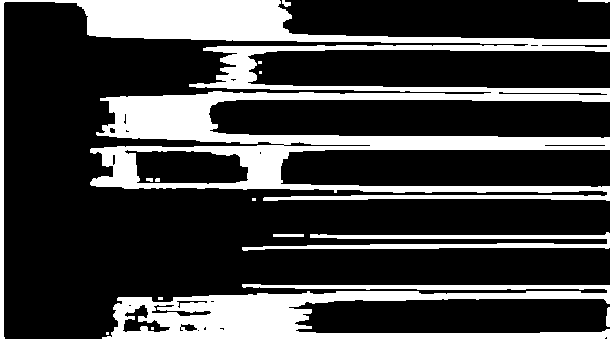


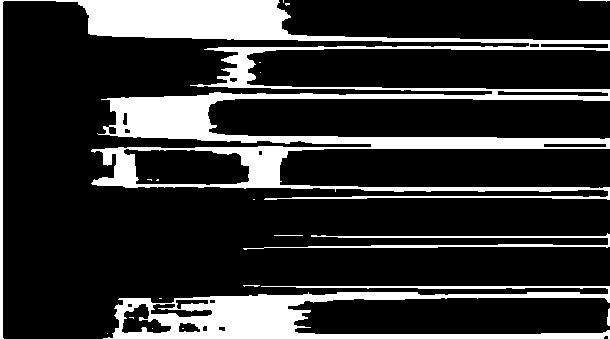
:::


### Edge detection

The code is `EdgeDetection.py`.

Before edge detection is based on the convolution operation of edge detection kernel with image. 

Convolution is a mathematical operation that one kernel slides through the image and produces a new image. Its mechanism is like ‘look at its neighbor pixel, multiply by a kernel, add results and then write new pixel.

Here is an example of convolution of a 3$\times$3 kernel $K$ onto a 3$\times$3 image $I$:
$$\mathrm{Output}[i,j] = \sum_{m=-1}^1\sum_{n=-1}^1 K[m,n] \cdot I[i+m, j+n]$$
The edge is defined as sudden intensity changes between neighbor pixels.

```{.python startFrom="17" code-line-numbers="true"}
# horizontal edge detection kernel 
kernel_horizon = np.array([[-3, -9, -3],
                           [ 0,  0,  0],
                           [ 3,  9,  3]])
 
# vertical edge detection kernel 
kernel_vertical = np.array([[-3,  0,  3],
                            [-9,  0,  9],
                            [-3,  0,  3]])

# all direction edge detection kernel
kernel_full = np.array([[ 0, -1,  0],
                        [-1,  4,  -1],
                        [ 0,  -1,  0]])
```

There are 3 kernels introduced, they are Scharr Operator (horizontal and vertical kernel) and Laplacian Operator (all direction).

The sum of kernel elements is 0 because they are edge detectors, the Scharr Operator is 1st derivative, and the Laplacian Operator is 2nd derivative. If the pixels' intensity has no change, the output of the kernel is 0.

The convolution operation is done by `cv2.filter2D(original image, depth, convolution kernel, output image)`. For parameter depth, $-1$ means the same as the input image depth.

```{.python startFrom="37" code-line-numbers="true"}
# convolution
#cv2.filter2D(imput image, depth of image（-1 means same as image depth）, convolution kernel,  output image)
cv2.filter2D(img_1, -1, kernel_horizon,  img_horizon)
cv2.filter2D(img_1, -1, kernel_vertical, img_vertical)
cv2.filter2D(img_1, -1, kernel_full,     img_full)
```

The original image is shown below:

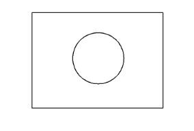{width=50%}

The output of horizontal and vertical edge detector is shown below:

::: {layout-ncol=2}
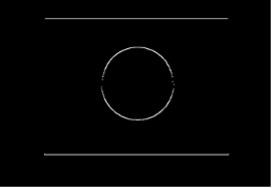

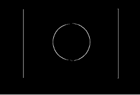
:::

The output of all direction edge detector is shown below:

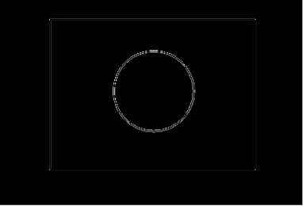{width=50%}

It is obvious that horizontal and vertical can only detect 1 edge, but the all direction edge detector got both edges. Because 1st derivative edge detectors can only detect rising or falling edges. In our example, the horizontal and vertical edge detector is rising from up to down and left to right. Thus, only rising edges are detected. 

## Image processing of OpenCV in ROS2 {#image-processing-ros2}

In this part, please move to the robot car. And run the code on the robot platform.

### Intro

First is the source of images. In ROS2, the image is from the topic published by 1 node. The image processing is executed from another node, and the result image will be published to another topic.

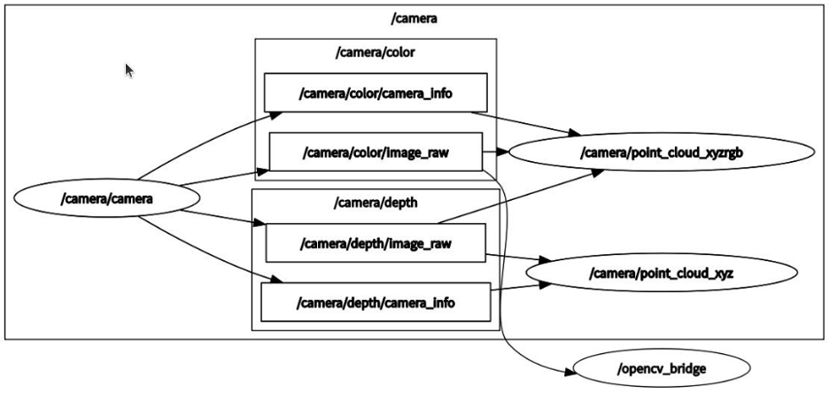{width=100%}

In the image above, a circle is a node and a rectangular is a topic. The node `camera/camera` publish multiple topics, which includes the topic `camera/color/image_raw`. The function of the node `camera/camera` is to read the camera data and publish to image related topics. And the same time, the node `/opencv_bridge` subscribed to the topic `/camera/color/image/raw`. The node `/opencv_bridge` is the node that will be introduced in the later sections.

### Run the code

Step 1: open terminal and run the code below to activate the camera:
```{.shell}
ros2 launch turn_on_wheeltec_robot wheeltec_camera.launch.py
```

Step 2: open another terminal to run the `/opencv_bridge` node:
```{.shell}
python3 opencv_ros2_test.py
```

Then, a new window will open, and two concentric circles will be presented at the upper left corner, the outer one is red, and the inner one is green.

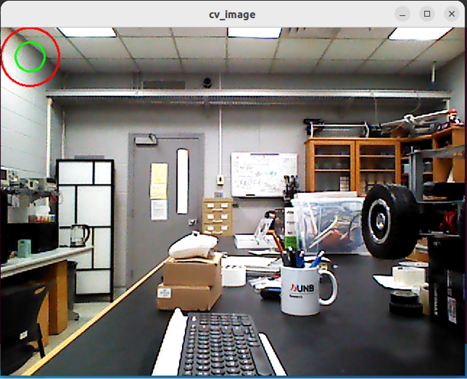{width=100%}

### Code Explanation

In the code below, the `rclpy` is the Python client library for `ros2`. The Node is the basic building block of the ROS2 system. The `CvBridge` and `cv2` are the image processing packages. Image is the datatype that was published in the topic.

```{.python startFrom="1" code-line-numbers="true"}
#!/usr/bin/env python3
# coding=utf-8

import rclpy
from rclpy.node import Node
from cv_bridge import CvBridge
import cv2
from sensor_msgs.msg import Image
```

```{.python startFrom="24" code-line-numbers="true"}
    def callback(self, msg):
        try:
            cv_image = self.bridge.imgmsg_to_cv2(msg, desired_encoding='bgr8')
        except Exception as e:
            self.get_logger().error(f"Failed to convert image: {e}")
            return

        (rows, cols, channels) = cv_image.shape
        if cols > 40 and rows > 40:
            cv2.circle(cv_image, (40, 40), 40, (0, 0, 255), 2)

        try:
            self.publisher_.publish(self.bridge.cv2_to_imgmsg(cv_image, encoding='bgr8'))
        except Exception as e:
            self.get_logger().error(f"Failed to convert image back: {e}")

        cv2.circle(cv_image, (40, 40), 20, (0, 255, 0), 2)
        cv2.namedWindow("cv_image", cv2.WINDOW_NORMAL)
        cv2.imshow("cv_image", cv_image)
        cv2.waitKey(10)
```

Class `ImageConverter` was created and inherited the class `Node`. At line 14, the constructor constructs a node named ‘opencv_bridge’. There are 3 variables in this class, they are `bridge`, `subscription` and `publisher_`. The `bridge` is initialized by `CvBridge()` function used to convert data type between `cv2` image and `ros2` image. The `subscription` is a subscriber that subscribes data with `Image` from topic `/camera/color/image_raw`, execute function `callback` and the quality of service is 10. The `publisher_` will publish data with type `Image` to the topic `/cv_bridge_image` and the quality of service is also 10 (queue size).
The callback function will be executed every 10 ms (line 43).
- First, this function will read the message and convert to `cv2` image in RGB format, and the data type is 8-digit unsigned integer (line 26).
- Then a circle centered at `(40, 40)` of $x$ and $y$, with 40 radius and red color will be sketched to the image. The image will convert back to `Image` format and be published (line 33-36).
- Finally, another circle centered at `(40, 40)`, with a radius 20 and green color (line 40). The result image will be shown in a new window (line 40-42).

```{.python startFrom="45" code-line-numbers="true"}
def main(args=None):
    rclpy.init(args=args)               # initialize the ros2 controller
    image_converter = ImageConverter()  # create a instance of ImageConverter class
    rclpy.spin(image_converter)         # spin the node, the node will not stop unless triggered 
    image_converter.destroy_node()      # destroy the node node when the spin terminated
    rclpy.shutdown()                    # shut down the robot controller

if __name__ == '__main__':
    main()
```

The `main` function is the starting point of a program. The general structure of a ROS2 python program is `rclpy.init()` and `rclpy.shutdown()`, which is to start the robot control client (line 46) and shut down the robot control client (line 50). A node was created by its constructor function `ImageConverter()` (line 47), then executed by the function `rclpy.spin()` (line 48) and destroyed in line 49.


# Line/Path Follower {#line-path-follower}

After introducing the basic image processing method by CV2, we will start to combine computer vision and robot control. The basic methodology is to set the threshold for every color channel to identify the region of interest, then get the difference between the current location and desired location. Finally, add the controller to control the robot to reach the goal.

## Intro of Image Moments and Hu Moments

The coordinate system of images is that the coordinate origin is the upper left corner of the image pixel, the horizontal right direction is positive $x$-axis and vertical down direction is positive $y$-axis.

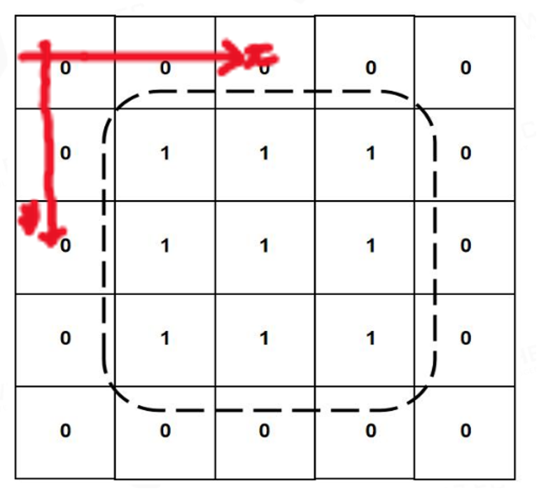{width=50%}

The **Moments** of an image is its measure of the area, center, and orientation of the shape. The Raw Moments is defined as
$$
M_{pq} = \sum_x \sum_y x^p y^q f(x,y)
$$
where $p$ and $q$ are the order of moments, $f(x,y)$ is the pixel values at position $(x, y)$, and $M_{pq}$ is the sum of moments of orders $p$ and $q$.

| Parameter | Function | Meaning   |
|:----------|:---------|:----------|
| $M_{00}$  | $\displaystyle\sum f(x,y)$           | Area of the image |
| $M_{10}$  | $\displaystyle\sum x \cdot f(x,y)$   | $x$-axis 1st moment |
| $M_{01}$  | $\displaystyle\sum y \cdot f(x,y)$   | $y$-axis 1st moment |
| $\bar{x}$ | $\displaystyle\frac{M_{10}}{M_{00}}$ | $x$-axis centroid |
| $\bar{y}$ | $\displaystyle\frac{M_{01}}{M_{00}}$ | $y$-axis centroid |
| $\mu_{pq}$ | $\displaystyle\sum_x \sum_y (x-\bar{x})^p (y-\bar{y})^q f(x,y)$ | Central moment of order $(p,q)$ |
| $\eta_{pq}$ | $\displaystyle\frac{\mu_{pq}}{\mu_{00}^{1+(p+q)/2}}$ | Normalized central moment of order $(p,q)$ |

Hu Moments are 7 mathematical values that describe the shape of an object in an image. The property of Hu Moments it that it is invariant to translation, rotation, scaling and reflection.

The moments could be obtained from `moments()` function in OpenCV package. The moments will return a dictionary, which includes `m00`, `m10`, `m01`, `muxx` and so on.
In OpenCV, the `HuMoments()` function will return 7 parameters by 7*1. The input of this function is the returned results of `moments()`.


## Line Following {#line-following}

Check the videos and materials in: [`R550PLUS ROS大型科研机器人资料（ROS大车）/1.WHEELTEC ROS机器人通用资料/6.ROS2系列教程/3.ROS2机器人应用视频教程：相机与图像处理/4.ROS2视觉巡线`](https://unbcloud-my.sharepoint.com/:f:/r/personal/j7e8q_unb_ca/Documents/IMRL_2025_manuals/WheelTECH/R550PLUS%20ROS%E5%A4%A7%E5%9E%8B%E7%A7%91%E7%A0%94%E6%9C%BA%E5%99%A8%E4%BA%BA%E8%B5%84%E6%96%99%EF%BC%88ROS%E5%A4%A7%E8%BD%A6%EF%BC%89/1.WHEELTEC%20ROS%E6%9C%BA%E5%99%A8%E4%BA%BA%E9%80%9A%E7%94%A8%E8%B5%84%E6%96%99/6.ROS2%E7%B3%BB%E5%88%97%E6%95%99%E7%A8%8B/3.ROS2%E6%9C%BA%E5%99%A8%E4%BA%BA%E5%BA%94%E7%94%A8%E8%A7%86%E9%A2%91%E6%95%99%E7%A8%8B%EF%BC%9A%E7%9B%B8%E6%9C%BA%E4%B8%8E%E5%9B%BE%E5%83%8F%E5%A4%84%E7%90%86/4.ROS2%E8%A7%86%E8%A7%89%E5%B7%A1%E7%BA%BF?csf=1&web=1&e=huUljp)

The general steps include denoise, line centroid detection, and control.

The denoise is accomplished by erosion and dilation of image, whose concept is introduced in [Erosion and Dilation](#erosion-and-dilation) section. The code below defines a kernel with size 5$\times$5 pixels, apply erosion, and then dilation.

```{.python startFrom="55" code-line-numbers="true"}
        kernel = np.ones((5, 5), np.uint8)
        hsv_erode = cv2.erode(hsv, kernel, iteration=1)
        hsv_dilate = cv2.dilate(hsv_erode, kernel, iteration=1)
```

When the image was denoised, a binary mask will be applied to the image to capture pixels that is in the color range we wish.

```{.python startFrom="102" code-line-numbers="true"}
        mask = cv2.inRange(hsv_dilate, (lowerbH, lowerbS, lowerbV), (upperbH, upperbS, upperbV))
```

The result is a binary image that all pixels in color range will set to 1. Then, the center of the shape will be calculated. First, the moments of the shape were calculated by the returned parameter of function `moments()`.

```{.python}
        M = cv2.moments(mask)
        cx = int(M['m10'] / M['m00'])
        cy = int(M['m01'] / M['m00'])
```

The last step is control. This is accomplished by calculating the distance between the image center and the shape center, then controlling the robot to turn in the opposite direction.

```{.python}
        erro = cx - w/2 - 60
        self.twist.linear.x = 0.11
        self.twist.angular.z = -(float(erro)*0.0011 - float(d_erro)*0.0000)
        self.cmd_vel_pub.publish(self.twist)
```

### Create ROS2 package {-}

First, a ROS2 workspace is shown below:

```bash
ros2_ws/
├── src/            # Source code (ROS 2 packages go here)
├── install/        # Installed/compiled targets (created by colcon build)
├── build/          # Build system's temporary files
└── log/            # Build and runtime logs
```

We will write our code in `/src` folder. Another remarkable thing is that when we make modifications, we should run `source install/setup.bash` in terminal to update the environment parameters.

In our code, the workspace is wheeltec_ros2, so we will run `cd ~/wheeltec_ros2/src` in the terminal.

The next step is to build the ros2 package. The format is:
```bash
ros2 pkg create simple_follower_ros2 --build-type ament_python --dependencies rclpy std_msgs
```

The format of creating a `python` ROS2 package is `ros2 pkg create` + `<package name>` + `--build-type ament_python` + `--dependencies <dependencies>`. The dependencies are the package that is required by the package we created. `--build-type ament_python` means the type of package is a `python` package.

In this code, we created a python ROS2 package called `simple_follower_ros2`. The dependencies are `std_msgs` and `rclpy`. The `rclpy` is the ROS2 client library for writing python codes. The `std_msgs` supplied some common message types that can be published and subscribed between nodes like String, Int32, Float64 and so on.

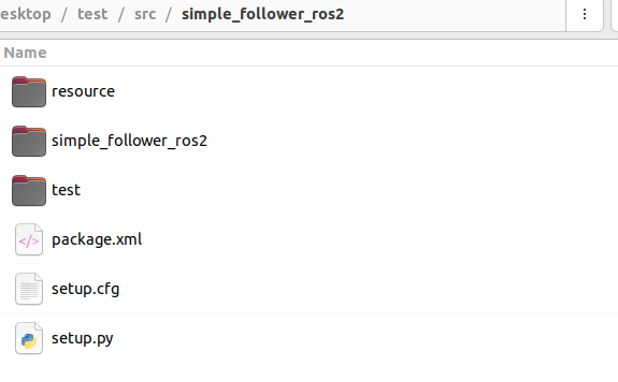{width=60%}

When a package is created, it has a folder created in `/src` named `simple_follower_ros2`, which is the same as package name. Inside this folder, there is a folder that has the same name, also called `simple_follower_ros2`. Our code will be placed in this folder.

Thus, the code we introduced above `line_follow.py` will be placed in `/src/simple_follower_ros2/simple_follower_ros2`

Another remarkable thing is `setup.py`, this is the place that we will define executables. Executable in ROS2 refer to a python nodes that can be launched using `ros2 run`. They're defined in `setup.py`.

When we open the `setup.py`, it is from scratch, and we will edit it to define executables.

{width=50%}

There are 2 parameters we will modify, `data_files` and `entry_points`. The `data_files` contain all of the files with directories that will be executed. The `entry_points` contain the names or keys of the executables. When the package is compiled, files in data files and scripts in entry points will be accessible from the ros2 command.
The entry points contain the parameter `control_scripts`, which is a list of strings. The format string is `script_name = package_name.folder_name.file_name:function`. For example. For we create a script called `line_follow`, who will call the main function of `line_follow.py` in the `simple_follower_ros2` folder of this function. Thus, we will add `line_follow  = simple_follower_ros2.line_follow:main`.

The `data_files` structure is listed below:

```{.python}
data_files=[
    # 1. Package marker (essential for ROS2 to find your package)
    (
        'share/ament_index/resource_index/packages',
        ['resource/' + package_name]
    ),
    
    # 2 . Package metadata
    ('share/' + package_name, ['package.xml']),

    # 3 . Launch files
    (
        os.path.join('share', package_name, 'launch'),
        glob('launch/*.launch.py')
    ),

    # 4. Configuration files
    (
        os.path.join('share', package_name, 'config'),
        glob('config/*.yaml')
    ),

    # 5. URDF/Robot description files
    (
        os.path.join('share', package_name, 'urdf'),
        glob('urdf/*.urdf')
    ),

    # 6 . World files (Gazebo)
    (
        os.path.join('share', package_name, 'worlds'),
        glob('worlds/*.world')
    ),

    # 7. RViz configurations
    (
        os.path.join('share', package_name, 'rviz'),
        glob('rviz/*.rviz')
    ),
]
```

Most cases, the package will share their property as dependencies of other packages, thus we need to include all of them and direct to `/share` folder. There are 2 remarkable tips. The first is that we need to import the `os` and use `os.path.join()`. Compare to typing them directly, using this function will have a better compatibility among different platforms. The second is `glob`, this is a module to filter path pattern matching. We may have more than 1 file that has the same type (like multiple launch files). By using `glob`, we can get all of them in 1 single line, and we do not have to include new files manually if we make any changes.

```{.python code-line-numbers="true"}
from setuptools import setup
import os
from glob import glob

package_name = 'simple_follower_ros2'

setup(
    name=package_name,
    version='0.0.0',
    packages=[package_name],
    data_files=[
        ('share/ament_index/resource_index/packages', ['resource/' + package_name]),
        (os.path.join('share', package_name), glob('launch/*.launch.py')),
        (os.path.join('share', package_name), ['package.xml']),
    ],
    install_requires=['setuptools', 'launch'],
    zip_safe=True,
    maintainer='wheeltec',
    maintainer_email='powrbv@gmail.com',
    description='TODO: Package description',
    license='Apache-2.0',
    tests_require=['pytest'],
    entry_points={
        'console_scripts': [
            'line_follow = simple_follower_ros2.line_follow:main',
        ],
    },
)
```

Next, we will write a launch file. The launch file will allow us to run multiple scripts (or nodes) at the same time, so we do not have to open multiple terminals. We will create a folder called `launch` in the package.

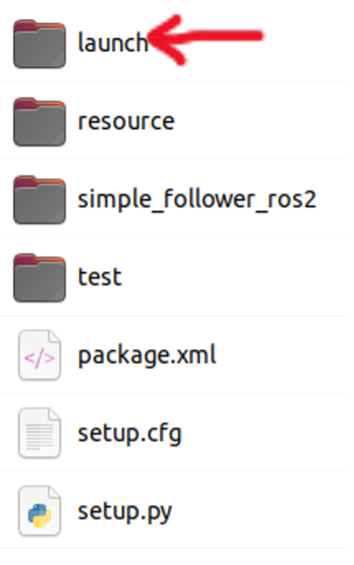{width=30%}

In the launch folder, create a new file called `line_follower.launch.py`.

The launch file in ROS2 is a `python` script that automates and manage the starting of multiple nodes and other launch files. A ros2 launch file is built by creating a function that returns a `LaunchDescription` object. This object contains a list of actions to be executed by the launch file. There are two kinds of action we will use: `Node` and `IncludeLaunchDescription`. The `Node` imported from launch.actions. The `IncludeLaunchDescription` imported from launch.actions.

```{.python code-line-numbers="true"}
import os
import launch_ros.actions
from ament_index_python.packages import get_package_share_directory
from launch import LaunchDescription
from launch.actions import (DeclareLaunchArgument, IncludeLaunchDescription)
from launch.launch_description_sources import PythonLaunchDescriptionSource
from launch.actions import DeclareLaunchArgument
from launch.substitutions import LaunchConfiguration
from launch.conditions import IfCondition
from launch.conditions import UnlessCondition
from launch.actions import ExecuteProcess

def generate_launch_description ():
    is_uvc_cam = LaunchConfiguration('is_uvc_cam', default='false')

    bringup_dir = get_package_share_directory('turn_on_wheeltec_robot')
    launch_dir = os.path.join(bringup_dir, "launch")

    wheeltec_camera = IncludeLaunchDescription(
        PythonLaunchDescriptionSource(os.path.join(launch_dir, 'wheeltec_camera.launch.py')),
    )
    wheeltec_robot = IncludeLaunchDescription(
        PythonLaunchDescriptionSource(os.path.join(launch_dir, 'turn_on_wheeltec_robot.launch.py')),
    )
    return LaunchDescription([
        wheeltec_robot, wheeltec_camera,

        launch_ros.actions.Node(
            package='simple_follower_ros2',
            executable='line_follow',
            name="line_follow",
        )]
    )
```

The `Node` include 3 fundamental parameters: `package`, `executable` and `name`. Line 28-31 runs the executable ‘line_follow’ from package `simple_follower_ros2` and name the node with `line follow`.

The `includeLaunchDescription` is imported from `launch.actions` (line 5). The goal is to execute a python launch file from another packages. The first is to get the location of that launch file. We need to import `get_package_share_directory` from `ament_index_python.packages` (line 3). As introduced before, packages were compiled into the share folder, so when we want get access to specific external package, we could get it easily.

Two launch files in `turn_on_wheeltec_robot` package will be launched, they are `wheeltec_camera.launch.py` and `turn_on_wheeltec.launch.py`. First, the package location was acquired by `get_package_share_directory()` function and used `os.path.join()` to access the `launch` folder (line 16-17). Then corresponding actions were defined in line 19-24. Finally, actions were returned in line 26.

### Compile {-}

The next step is to compile the package.

First, for all of the compiling action: `cd ~/wheeltec/wheeltec_ros2`
To compile all of the packages, type `colcon build` in terminal. But this might take a long time.
To compile a single package, type `colcon build --packages-select package_name`

So, when we add the script to folder, modify `setup.py` and create the launch file, we can compile the package.

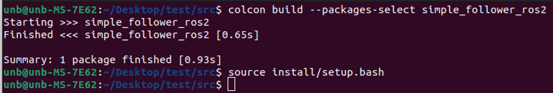

As shown above, the `simple_follower_ros2` was compiled. Whenever we compile packages, we need to source `setup.bash` file in the install folder to validate our changes.


## Path Following {#path-following}

Check the videos and materials in: [`R550PLUS ROS大型科研机器人资料（ROS大车）/1.WHEELTEC ROS机器人通用资料/6.ROS2系列教程/4.ROS2机器人进阶应用视频教程/8.ROS2 路径跟踪`](https://unbcloud-my.sharepoint.com/:f:/r/personal/j7e8q_unb_ca/Documents/IMRL_2025_manuals/WheelTECH/R550PLUS%20ROS%E5%A4%A7%E5%9E%8B%E7%A7%91%E7%A0%94%E6%9C%BA%E5%99%A8%E4%BA%BA%E8%B5%84%E6%96%99%EF%BC%88ROS%E5%A4%A7%E8%BD%A6%EF%BC%89/1.WHEELTEC%20ROS%E6%9C%BA%E5%99%A8%E4%BA%BA%E9%80%9A%E7%94%A8%E8%B5%84%E6%96%99/6.ROS2%E7%B3%BB%E5%88%97%E6%95%99%E7%A8%8B/4.ROS2%E6%9C%BA%E5%99%A8%E4%BA%BA%E8%BF%9B%E9%98%B6%E5%BA%94%E7%94%A8%E8%A7%86%E9%A2%91%E6%95%99%E7%A8%8B/8.ROS2%20%E8%B7%AF%E5%BE%84%E8%B7%9F%E8%B8%AA?csf=1&web=1&e=9INDeT)

The path following function is accomplished by BasicNavigator class in `nav2_simple_commander` package. Thus, the `nav2` package has to run first.

The path following function has 2 subfunctions: path record and path follow. After running the `nav2` package, we will run the path record function and control the robot at the same time. The path record function will save the path and write to a file. The path following function will read this file and acquire path info, send to `BasicNavigator` class. Then `nav2` will navigate the robot to follow this path.

- Path record

    The first step is to run the nav2 package:

    ```bash
    ros2 launch wheeltec_nav2 wheeltec_nav2.launch.py
    ```

    Then, open `rviz2` in another terminal to visualize the result:

    ```bash
    ros2 launch wheeltec_rviz2 wheeltec_rviz.launch.py
    ```

    The second step is to stare the path record function,

    ```bash
    ros2 launch wheeltec_path_follow save_path.launch.py
    ```
    
    Then, run the keyboard control to control the robot

    ```bash
    ros2 run wheeltec_robot_keyboard wheeltec_keyboard
    ```

    To visualize the path in `rviz2`, subscribe the `/followpath` topic in `rviz2`. When using CTRL+C to terminate the `save_path.launch.py`, the path will be saved to the `path` folder.

- Path following

    The first step is to run the `nav2` package:

    ```bash
    ros2 launch wheeltec_nav2 wheeltec_nav2.launch.py
    ```

    Then, open `rviz2` in another terminal to visualize the result:

    ```bash
    ros2 launch wheeltec_rviz2 wheeltec_rviz.launch.py
    ```

    Then run the path follow function:

    ```bash
    ros2 launch wheeltec_path_follow follow_path.launch.py
    ```

    The robot will be navigated to the starting point first, then navigate the robot to follow the path. When it reaches the end of the path, the robot will navigate to the starting point again and enter a new cycle.


# Object Following {#object-following}

## Vision-Based {#vision-based-object-following}

Check the videos and materials in: [`R550PLUS ROS大型科研机器人资料（ROS大车）/1.WHEELTEC ROS机器人通用资料/6.ROS2系列教程/3.ROS2机器人应用视频教程：相机与图像处理/3.ROS2视觉跟随`](https://unbcloud-my.sharepoint.com/:f:/r/personal/j7e8q_unb_ca/Documents/IMRL_2025_manuals/WheelTECH/R550PLUS%20ROS%E5%A4%A7%E5%9E%8B%E7%A7%91%E7%A0%94%E6%9C%BA%E5%99%A8%E4%BA%BA%E8%B5%84%E6%96%99%EF%BC%88ROS%E5%A4%A7%E8%BD%A6%EF%BC%89/1.WHEELTEC%20ROS%E6%9C%BA%E5%99%A8%E4%BA%BA%E9%80%9A%E7%94%A8%E8%B5%84%E6%96%99/6.ROS2%E7%B3%BB%E5%88%97%E6%95%99%E7%A8%8B/3.ROS2%E6%9C%BA%E5%99%A8%E4%BA%BA%E5%BA%94%E7%94%A8%E8%A7%86%E9%A2%91%E6%95%99%E7%A8%8B%EF%BC%9A%E7%9B%B8%E6%9C%BA%E4%B8%8E%E5%9B%BE%E5%83%8F%E5%A4%84%E7%90%86/3.ROS2%E8%A7%86%E8%A7%89%E8%B7%9F%E9%9A%8F?csf=1&web=1&e=9BrWTr)

First and the most important thing is the indexing system in OpenCV. As mentioned in [Line Follower](#line-following) section, we usually describe image coordinated using $(x,y)$, where $x$ is the horizontal coordinate and $y$ is the vertical coordinate. However, OpenCV uses (row, column) indexing when accessing pixel values. So, the coordinate system and the indexing system are effectively inverted, which means <span style="background-color:yellow">$x$ corresponds to the column index, $y$ corresponds to row index</span>. When converting between coordinate format $(x,y)$ and image index format (row, column), you must swap the two values.

Ok, let's go back to the coordinate system. When we read an image, its index is [row, column].

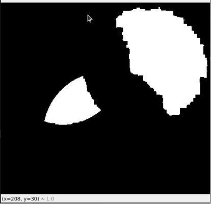{width=50%}

The position of pointer is `x=208, y=30`. So, if we want to change that pixel to white, we need to set its value to 255. When we set the pixel indexed **mistakenly** with `[208, 30]` to 255 by execute the code below:

```python
img_de[208, 30] = 255
```

The result is shown here:

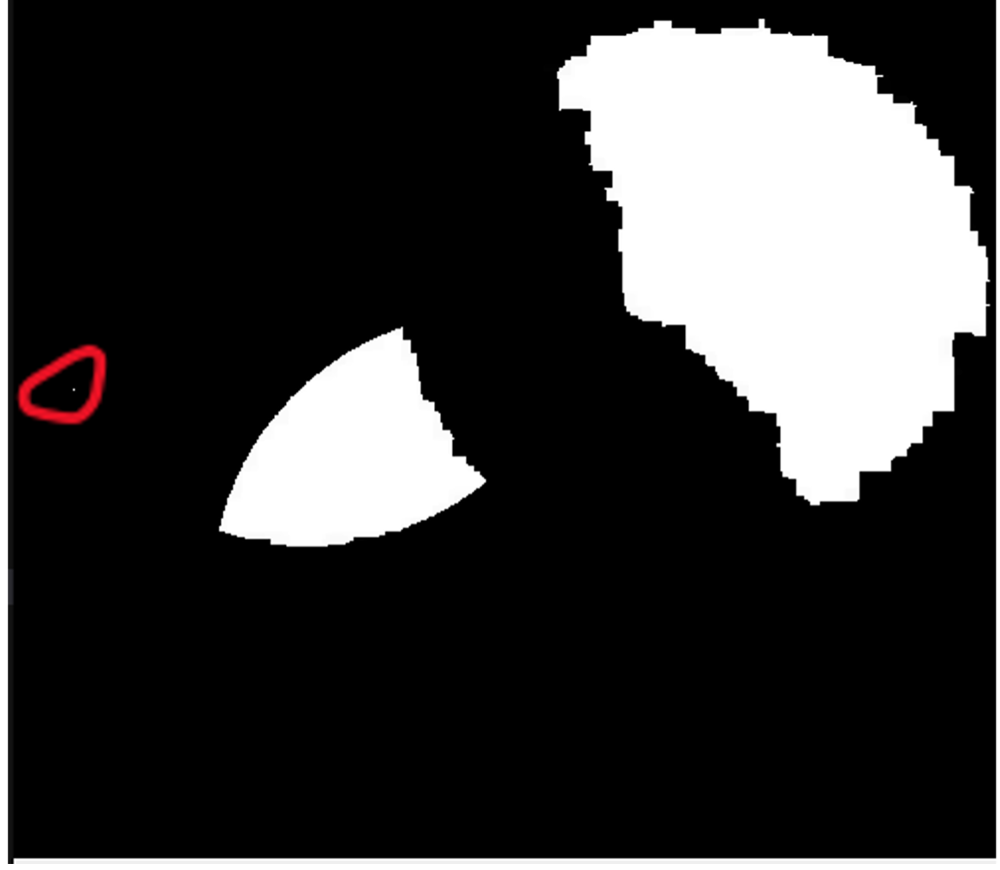{width=50%}

The white dot appeared in the wrong place; it is mirrored along the 45-degree diagonal. Thus, the correct position of this pixel indexed with row and column is `[30, 208]`.

### Overview

There are 2 scripts involved in this part, they are `visualTracker.py` and `visualFollower.py`.

The `visualTracker` process the synchronized RDB depth images from a camera to detect a color target, compute its position and publish the target’s 3D position and angular offset relative to the camera.

The `visualFollower` receives the target position (`/cmd_vel`) data and generates motion commands for the robot to follow the target using PID control loop.

### Intro-VisualTracker.py

The mechanism of object tracking is to acquire the RGB image and depth image simultaneously, then apply masking to get the region of interest, get the contour for each ROI, find the contour that has max area. Finally, validate through depth images.

#### Camera properties {-}

```{.python startFrom="36" code-line-numbers="true"}
        self.pictureHeight = 480
        self.pictureWidth = 640
        vertAngle = 0.43196898986859655
        horizontalAngle = 0.5235987755982988
```

```{.python startFrom="42" code-line-numbers="true"}
        self.tanVertical = np.tan(vertAngle)
        self.tanHorizontal = np.tan(horizontalAngle)
```

The code above shows the resolution and view range (rad) of camera. Then, calculate the tangent value of the view range. 

#### Camera Image subscription {-}

```{.python startFrom="3" code-line-numbers="true"}
import message filters
```

```{.python startFrom="46" code-line-numbers="true"}
        im_sub = message_filters.Subscriber(self, Image, "/camera/color/image_raw")
        dep_sub = message_filters.Subscriber(self, Image, "/camera/depth/image_raw", qos_profile=qos_profile_sensor_data)
        queue_size = 30

        self.timeSynchronizer = message_filters.ApproximateTimeSynchronizer([im_sub, dep_sub], queue_size, 0.05)
        self.timeSynchronizer.registerCallback(self.trackObject)
```

Line 46 and line 47 defined the subscription method. In this part, `message_filters` were imported because it is essential to make sure the color image and depth image were subscribed simultaneously as a corresponding pair. It is essential for the accuracy and stability of object tracking.

After receiving the raw color image and raw depth image, they will pass to `trackObject` function.

```{.python startFrom="56" code-line-numbers="true"}
    def trackObject(self, image_data, depth_data):
        if (image_data.encoding != 'rgb8'):
            raise ValueError(' image is not rgb8 as expected')
        #convert both images to numpy arrays
        frame = self.bridge.imgmsg_to_cv2(image_data, desired_encoding='rgb8')
        depthFrame = self.bridge.imgmsg_to_cv2(depth_data, desired_encoding='passthrough')#"32FC1")
        if (np.shape(frame)[0:2] != (self.pictureHeight, self.pictureWidth)):
            raise ValueError('image does not have the right shape. shape(frame): {}, shape parameters: {}'.format(np.shape(frame), (self.pictureHeight, self.pictureWidth)))
```

The first step is to check the format of color image and depth image named `image_data` and `depth_data` respectively.

In line 57, the format of color image was checked to be `rgb8`, then line 60, converting Image messsage to `cv2` format. Line 61 converts the depth image to `cv2` format. By using `desired_encoding = 'passthrough'`, pixels value and format in depth camera keep unchanged, which is 32FC1 (32-bit float [mm]).

```{.python startFrom="28" code-line-numbers="true"}
        self.targetUpper = np.array([0, 50, 50])
        self.targetLower = np.array([180, 255, 255])
```

```{.python startFrom="66" code-line-numbers="true"}
        hsv = cv2.cvtColor(frame, cv2.COLOR_RGB2HSV)
        # select all the pixels that are in the range specified by the target
        org_mask = cv2.inRange(hsv, self.targetUpper, self.targetLower)
```

```{.python startFrom="71" code-line-numbers="true"}
        mask = cv2.erode(org_mask, None, iterations=4)
```

The line 28-29 defines the upper and lower bound of target color in HSV color space. So, line 66, the color space converted from RGB to HSV and then in line 68 to get the filtered result by `cv2.inRange()`. Finally, the returned result will be eroded to denoise. The `erode` function has 3 parameters, which is the input mask, the kernel (None means 3$\times$3 kernel by default), and number of iterations.

```{.python startFrom="75" code-line-numbers="true"}
        contours = cv2.findContours(mask.copy(), cv2.RETR_EXTERNAL, cv2.CHAIN_APPROX_SIMPLE)[-2]
```

Since there may be multiple interest areas, the contour of each interest area was detected by function `cv2.findContours()`.

The first parameter is the source image, which is the denoised mask. The second parameter is contour retrieval mode. In this code we use `cv2.RETR_EXTERNAL`, which means the external contour was retrieved and the internal contour was ignored. The third parameter is the contour approximation method. The `cv2.CHAIN_APPROX_SIMPLE` was used because of its high efficiency. This parameter compresses horizontal, vertical, and diagonal segments and leaves only their end points. For example, a rectangle will be encoded with only 4 points.

There are 2 returned values; they are `contours` and `hierarchy`. The `contours` is a tuple of NumPy arrays, each array contains $(x,y)$ coordinates of the contour points. The `hierarchy` is the topologic relationship between contours, which is not included in this part. This is the reason we add index `[-2]` for returned value.


